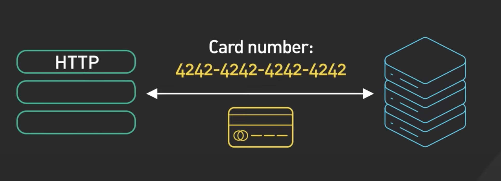
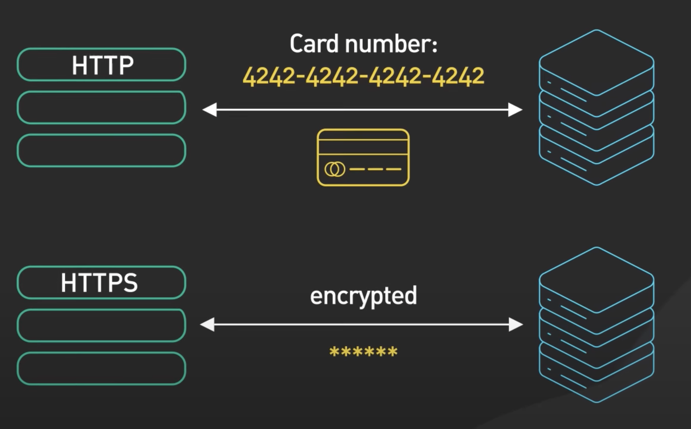
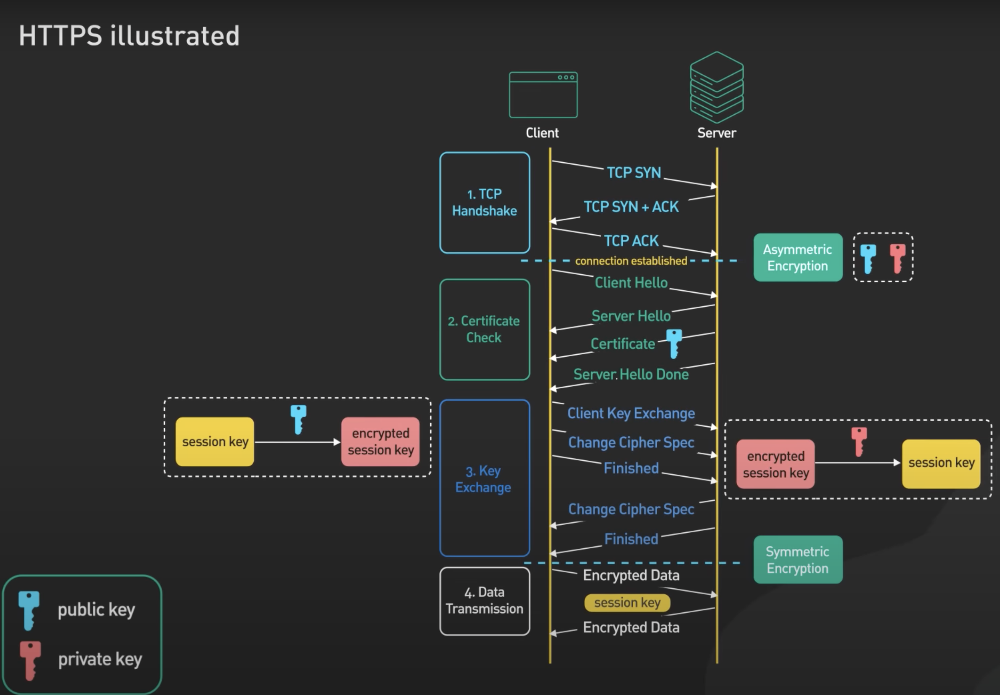

# Topic 1: Network Fundamentals

This topic covers the basics of networks, divided into three main parts:

- **Part 1: Overview of DNS**
- **Part 2: Communication Protocols**
- **Part 3: Demo - Client-Server Communication with gRPC**

## Part 1: Overview of DNS

### 1. What is DNS?

DNS stands for **Domain Name System**. It is a critical component of the internet that translates human-readable domain names, like `www.example.com`, into machine-readable IP addresses, such as `192.0.2.1`, which computers use to locate and communicate with each other.

- **Example:** When you enter `https://www.facebook.com/` in your browser, DNS translates the domain name into the IP address `157.240.22.35`, allowing your browser to locate Facebook's servers.

### 2. How Does DNS Work?

DNS functions through a series of steps to resolve a domain name to its corresponding IP address.

#### Step-by-Step Process:

1. **User Request:**
   - A user opens a web browser, enters a domain (e.g., `www.example.com`), and presses Enter.

2. **Local DNS Cache Check:**
   - The computer checks its local DNS cache (in RAM) to see if it already knows the IP address of the domain. If found, the process skips to step 8.

3. **Query to DNS Recursive Resolver:**
   - If the IP is not cached, the request is sent to a DNS recursive resolver (usually provided by the ISP).

4. **Root Name Server Query:**
   - The resolver queries a Root Name Server, which directs it to the appropriate Top-Level Domain (TLD) server.
   - Example:
      1) Generic Top-Level Domains:
         + .com (commercial)
         + .org (organization)
         + .net (network)
         + .info (information)
         + .biz (business)
      2) Country Code Top-Level Domains
         + .uk (United Kingdom)
         + .jp (Japan)
         + .fr (France)
         + .cn (China)
      3) Sponsored Top-Level Domains 
         + .edu (education, sponsored by EDUCAUSE)
         + .gov (government, sponsored by the U.S. government)
         + .mil (military, sponsored by the U.S. Department of Defense)

5. **TLD and Authoritative Name Server Query:**
   - The resolver then queries the TLD server, which points it to the domain's Authoritative Name Server to get the IP address.

6. **IP Address Resolution:**
   - TThe Authoritative Name Server provides the IP address for the domain.

7. **Return IP to Browser:**
   - The resolver returns the IP address to the browser.

8. **Content Retrieval:**
   - The browser uses the IP address to request content from the server and displays the webpage.

#### Example: DNS with Multiple IP Addresses

- `google.com.vn.    IN    A    203.0.113.1`  (Vietnam server)
- `google.com.vn.    IN    A    198.51.100.2` (Singapore server)
- `google.com.vn.    IN    A    192.0.2.3`    (US server)

These IP addresses enable load balancing and geographic distribution.

### 3. Pros and Cons of DNS

#### Pros

- **Ease of Use:** DNS abstracts complex IP addresses into simple, memorable domain names, making it easier for users to navigate the internet.
- **Scalability:** DNS is highly scalable, supporting billions of domain names worldwide.
- **Redundancy and Load Balancing:** DNS allows the use of multiple IP addresses for a single domain, enabling load balancing and fault tolerance.
- **Security Enhancements:** Protocols like DNSSEC (DNS Security Extensions) add a layer of security by ensuring that DNS responses are authentic.

#### Cons

- **Complex:** DNS server management could be complex and is generally managed by governments, ISPs, and large companies.
- **Latency:** Each DNS query adds a small delay to web requests, though caching helps mitigate this.
- **DDos attack:** DNS services have recently come under DDoS attack, preventing users from accessing websites such as Twitter without knowing Twitter's IP address(es).

### 4. Top 6 Most Popular DNS Servers Today

1. **Google DNS**
   - **Preferred DNS Server:** `8.8.8.8`
   - **Alternate DNS Server:** `8.8.4.4`
   - **Overview:** Google DNS is widely used for its speed and reliability.

2. **OpenDNS**
   - **Preferred DNS Server:** `208.67.222.222`
   - **Alternate DNS Server:** `208.67.220.220`
   - **Overview:** A free and popular DNS service, second only to Google DNS.

3. **Cloudflare DNS**
   - **Preferred DNS Server:** `1.1.1.1`
   - **Alternate DNS Server:** `1.0.0.1`
   - **Overview:** Known for its security and privacy features, Cloudflare DNS also routes traffic through its protective layer.

4. **VNPT DNS**
   - **Preferred DNS Server:** `203.162.4.191`
   - **Alternate DNS Server:** `203.162.4.190`
   - **Overview:** The DNS service provided by VNPT, a major telecom operator in Vietnam.

5. **Viettel DNS**
   - **Preferred DNS Server:** `203.113.131.1`
   - **Alternate DNS Server:** `203.113.131.2`
   - **Overview:** Viettel’s DNS servers, used by subscribers of the Viettel network in Vietnam.

6. **FPT DNS**
   - **Preferred DNS Server:** `210.245.24.20`
   - **Alternate DNS Server:** `210.245.24.22`
   - **Overview:** DNS servers provided by FPT, another leading ISP in Vietnam.

## Part 2: Communication Protocols 

### 1. HTTP (Hypertext Transfer Protocol)

#### 1.1 What is HTTP ?

- HTTP is a method for encoding and transporting information between a client (such as a web browser) and a web server. HTTP is the primary protocol for transmission of information across the internet.

#### 1.2 How Does HTTP Work?

#### Step-by-Step Process:

1. **Client Request:** When you enter a URL into your browser, the browser sends an HTTP request to the server where the website is hosted.

- Server Response: The server processes the request and sends back an HTTP response. This response typically includes the requested web page, along with other resources like images, stylesheets, or scripts.

- Stateless Protocol: HTTP is stateless, meaning each request is independent, and the server doesn’t retain session information between requests.

#### 1.3 Why Use HTTP?

- Simplicity: HTTP is simple to use and widely supported by all web browsers and servers.

- Flexibility: It supports a variety of data types and methods, including GET, POST, PUT, DELETE, PATCH.

#### Cors HTTP

#### 1.4 Below are common HTTP verbs

#### 1.5 HTTP vs HTTPS
1. HTTP:
HTTP stands for Hypertext Transfer Protocol. It is the foundation of data communication on the web. However, HTTP data is transmitted in plaintext, making it vulnerable to interception and attacks.

2. HTTPS:
HTTPS (Hypertext Transfer Protocol Secure):
HTTPS is not a separate protocol but rather a combination of HTTP and TLS (or SSL in older implementations). It is the secure version of the standard HTTP protocol used for transmitting data between a client's web browser and a web server. When a website uses HTTPS, it means that the data exchanged between the client and the server is encrypted using TLS or SSL, ensuring that it cannot be intercepted or tampered with by unauthorized parties.

##### SSL vs TLS:

###### SSL:
Good mention of SSL as an older protocol. You could also clarify that SSL has been deprecated due to vulnerabilities like the POODLE attack and that modern browsers have completely phased out SSL support.

###### TLS:
Great explanation of TLS as the successor to SSL. You might also want to highlight the specific advancements in TLS 1.3, such as faster handshakes (which reduce latency) and the removal of outdated cryptographic algorithms, making it more secure and efficient.

#### Why using HTTPS ?  

+ Data Confidentiality: Ensures that data is encrypted and inaccessible to unauthorized users.
+ Data Integrity: Protects data from being modified or corrupted during transmission.
+ Authentication: Verifies the identity of the communicating parties, ensuring that users are connected to the legitimate website (prevents phishing attacks).
+ SEO Benefits: Search engines like Google rank HTTPS websites higher than HTTP sites.

##### Step-by-Step HTTPS Flow

###### 1. Client Request:
- Customer A types `https://www.facebook.com` in the browser.
- Sends a request to connect to Facebook's server.

###### 2. TCP Handshake:
- Establishes a basic connection between Customer A and Facebook.
- Steps: `SYN → SYN-ACK → ACK`.

###### 3. SSL/TLS Handshake Begins:
- Client (Customer A) sends a `ClientHello` message, including supported SSL/TLS versions and cipher suites.

###### 4. Server Responds:
- Server (Facebook) replies with a `ServerHello`, including its SSL certificate (with Facebook’s public key), and chosen SSL/TLS version and cipher suite.

###### 5. Certificate Verification:
- Client using public key in something called asymmetric encryption a piece of data that is encrypted by a public can only decrypted by the private key 
- Client verifies Facebook’s SSL certificate.
- If valid, the handshake continues.

###### 6. Session Key Generation:
- Client creates a pre-master secret (session key), encrypts it using Facebook's public key, and sends it to Facebook.
- Both the client and server generate a session key from this secret.

###### 7. Encrypted Data Transmission:
- Client encrypts sensitive data (e.g., username and password) using the session key and sends it to Facebook.

###### 8. Secure Communication:
- Server (Facebook) decrypts the data using the session key it with its private key.
- Communication continues securely.

###### 9. Hacker Attempts:
- A hacker may try to intercept the data but only sees encrypted information, which they cannot decrypt without the session key.

### 2. GRPC
### 3. Compare GRPC and HTTP
### 4. Compare Http 2.0 and Http 1.1

## Part 3: Demo client server communication GRPC