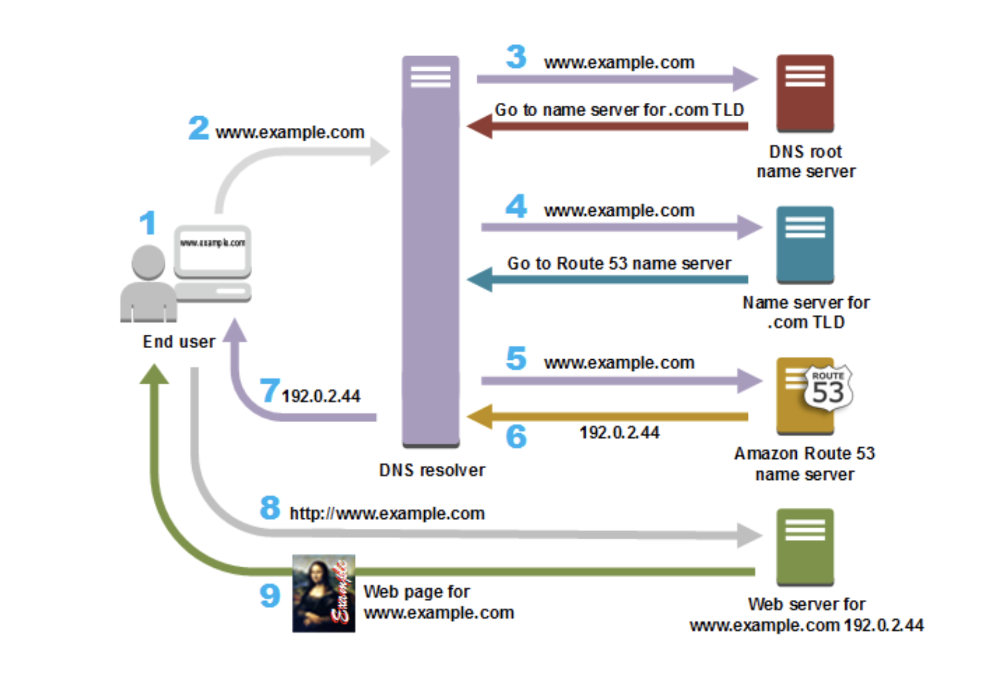

# Topic 1: Network Fundamentals

This topic covers the basics of networks, divided into three main parts:

- **Part 1: Overview of DNS**
- **Part 2: Communication Protocols**
- **Part 3: Demo - Client-Server Communication with gRPC**

## Part 1: Overview of DNS

### 1. What is DNS?

DNS stands for **Domain Name System**. It is a critical component of the internet that translates human-readable domain names, like `www.example.com`, into machine-readable IP addresses, such as `192.0.2.1`, which computers use to locate and communicate with each other.

- **Example:** When you enter `https://www.facebook.com/` in your browser, DNS translates the domain name into the IP address `157.240.22.35`, allowing your browser to locate Facebook's servers.

### 2. How Does DNS Work?

DNS functions through a series of steps to resolve a domain name to its corresponding IP address.

#### Step-by-Step Process:

1. **User Request:**
   - A user opens a web browser, enters a domain (e.g., `www.example.com`), and presses Enter.

2. **Local DNS Cache Check:**
   - The computer checks its local DNS cache (in RAM) to see if it already knows the IP address of the domain. If cached, it skips the following steps.

3. **DNS Query to Resolver:**
   - If the IP address is not cached, the computer sends a DNS query to a DNS resolver, typically provided by the user's Internet Service Provider (ISP).

4. **Query to Root Name Server:**
   - The DNS resolver forwards the request to a DNS root name server if it cannot resolve the domain itself.

5. **Name Server Response:**
   - If the root name server does not have the information, it directs the query to the appropriate top-level domain (TLD) server (e.g., `.com` for `www.example.com`).

6. **Authoritative Name Server Query:**
   - The TLD server then forwards the request to the domain's authoritative name server, which knows the exact IP address of the domain.

7. **IP Address Resolution:**
   - The authoritative name server responds with the IP address of the domain.

8. **Content Retrieval:**
   - The web browser sends an HTTP or HTTPS request to the server at the resolved IP address.

9. **Webpage Display:**
   - The server sends the requested content back to the browser, which then displays the webpage.

#### Example: DNS with Multiple IP Addresses

- `google.com.vn.    IN    A    203.0.113.1`  (Vietnam server)
- `google.com.vn.    IN    A    198.51.100.2` (Singapore server)
- `google.com.vn.    IN    A    192.0.2.3`    (US server)

These IP addresses enable load balancing and geographic distribution.

### 3. Pros and Cons of DNS

#### Pros

- **Ease of Use:** DNS abstracts complex IP addresses into simple, memorable domain names, making it easier for users to navigate the internet.
- **Scalability:** DNS is highly scalable, supporting billions of domain names worldwide.
- **Redundancy and Load Balancing:** DNS allows the use of multiple IP addresses for a single domain, enabling load balancing and fault tolerance.
- **Security Enhancements:** Protocols like DNSSEC (DNS Security Extensions) add a layer of security by ensuring that DNS responses are authentic.

#### Cons

- **Security Vulnerabilities:** DNS is susceptible to various attacks, such as DNS spoofing, cache poisoning, and Distributed Denial of Service (DDoS) attacks, which can disrupt internet access.
- **Latency:** Each DNS query adds a small delay to web requests, though caching helps mitigate this.
- **Complexity:** Managing DNS, especially with advanced configurations like DNSSEC, load balancing, or geo-DNS, can be complex and error-prone.

## Part 2: Communication Protocols 

### 1. HTTP (Hypertext Transfer Protocol)

#### 1.1 What is HTTP ?

- HTTP (Hypertext Transfer Protocol) is the foundation of data communication on the web. It's a protocol used for transferring hypertext requests and information on the internet.
It allows web browsers and servers to communicate by exchanging requests and responses.

#### 1.2 How Does HTTP Work?

- Client Request: When you enter a URL into your browser, the browser sends an HTTP request to the server where the website is hosted.

- Server Response: The server processes the request and sends back an HTTP response. This response typically includes the requested web page, along with other resources like images, stylesheets, or scripts.

- Stateless Protocol: HTTP is stateless, meaning each request is independent, and the server doesn’t retain session information between requests.

#### 1.3 Why Use HTTP?

- Simplicity: HTTP is simple to use and widely supported by all web browsers and servers.

- Flexibility: It supports a variety of data types and methods, including GET, POST, PUT, DELETE, etc.
Interoperability: HTTP is a standard protocol used by all web applications, making it the backbone of the World Wide Web.

### 2. GRPC
### 3. Compare GRPC and HTTP
### 4. Compare Http 2.0 and Http 1.1
### 5. Communication Protocols In System Design

## Part 3: Demo client server communication GRPC