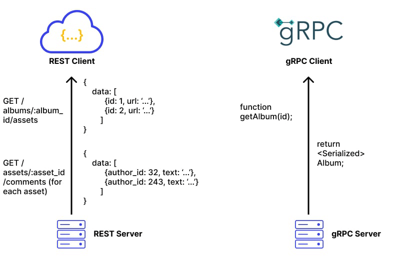

# Topic 1: Network Fundamentals

This topic covers the basics of networks, divided into three main parts:

- **Part 1: Overview of DNS**
- **Part 2: Communication Protocols**
- **Part 3: Demo - Client-Server Communication with gRPC**

# Table of Contents

1. [Overview of DNS](#overview-of-dns)
   - Introduction to DNS
   - How DNS Works
   - Pros and Cons of DNS
   - Popular DNS Servers

2. [Communication Protocols](#communication-protocols)
   - [HTTP and HTTPS](#http-and-https)
     - How HTTP and HTTPS Work
     - Differences Between HTTP and HTTPS
     - Security Indicators in Chrome Browser
   - [GRPC](#grpc)
     - Basic Concepts
     - How GRPC Works
     - Reasons to Use GRPC
     - Comparison of GRPC and HTTP/2

3. [Comparison of HTTP/2.0 and HTTP/1.1](#comparison-of-http20-and-http11)
   - Improvements of HTTP/1.1 Over HTTP/1.0
   - Issues with HTTP/1.1
   - Enhancements in HTTP/2

## Part 1: Overview of DNS

### 1. What is DNS?

DNS stands for **Domain Name System**. It is a critical component of the internet that translates human-readable domain names, like `www.example.com`, into machine-readable IP addresses, such as `192.0.2.1`, which computers use to locate and communicate with each other.

- **Example:** When you enter `https://www.facebook.com/` in your browser, DNS translates the domain name into the IP address `157.240.22.35`, allowing your browser to locate Facebook's servers.

### 2. How Does DNS Work?

DNS functions through a series of steps to resolve a domain name to its corresponding IP address.

#### Step-by-Step Process:

1. **User Request:**
   - A user opens a web browser, enters a domain (e.g., `www.example.com`), and presses Enter.

2. **Local DNS Cache Check:**
   - The computer checks its local DNS cache (in RAM) to see if it already knows the IP address of the domain. If found, the process skips to step 8.

3. **Query to DNS Recursive Resolver:**
   - If the IP is not cached, the request is sent to a DNS recursive resolver (usually provided by the ISP).

4. **Root Name Server Query:**
   - The resolver queries a Root Name Server, which directs it to the appropriate Top-Level Domain (TLD) server.
   - Example:
      1) Generic Top-Level Domains:
         + .com (commercial)
         + .org (organization)
         + .net (network)
         + .info (information)
         + .biz (business)
      2) Country Code Top-Level Domains
         + .uk (United Kingdom)
         + .jp (Japan)
         + .fr (France)
         + .cn (China)
      3) Sponsored Top-Level Domains 
         + .edu (education, sponsored by EDUCAUSE)
         + .gov (government, sponsored by the U.S. government)
         + .mil (military, sponsored by the U.S. Department of Defense)

5. **TLD and Authoritative Name Server Query:**
   - The resolver then queries the TLD server, which points it to the domain's Authoritative Name Server to get the IP address.

6. **IP Address Resolution:**
   - TThe Authoritative Name Server provides the IP address for the domain.

7. **Return IP to Browser:**
   - The resolver returns the IP address to the browser.

8. **Content Retrieval:**
   - The browser uses the IP address to request content from the server and displays the webpage.

#### Example: DNS with Multiple IP Addresses

- `google.com.vn.    IN    A    203.0.113.1`  (Vietnam server)
- `google.com.vn.    IN    A    198.51.100.2` (Singapore server)
- `google.com.vn.    IN    A    192.0.2.3`    (US server)

These IP addresses enable load balancing and geographic distribution.

### 3. Pros and Cons of DNS

#### Pros

- **Ease of Use:** DNS abstracts complex IP addresses into simple, memorable domain names, making it easier for users to navigate the internet.
- **Scalability:** DNS is highly scalable, supporting billions of domain names worldwide.
- **Redundancy and Load Balancing:** DNS allows the use of multiple IP addresses for a single domain, enabling load balancing and fault tolerance.
- **Security Enhancements:** Protocols like DNSSEC (DNS Security Extensions) add a layer of security by ensuring that DNS responses are authentic.

#### Cons

- **Complex:** DNS server management could be complex and is generally managed by governments, ISPs, and large companies.
- **Latency:** Each DNS query adds a small delay to web requests, though caching helps mitigate this.
- **DDos attack:** DNS services have recently come under DDoS attack, preventing users from accessing websites such as Twitter without knowing Twitter's IP address(es).

### 4. Top 6 Most Popular DNS Servers Today

1. **Google DNS**
   - **Preferred DNS Server:** `8.8.8.8`
   - **Alternate DNS Server:** `8.8.4.4`
   - **Overview:** Google DNS is widely used for its speed and reliability.

2. **OpenDNS**
   - **Preferred DNS Server:** `208.67.222.222`
   - **Alternate DNS Server:** `208.67.220.220`
   - **Overview:** A free and popular DNS service, second only to Google DNS.

3. **Cloudflare DNS**
   - **Preferred DNS Server:** `1.1.1.1`
   - **Alternate DNS Server:** `1.0.0.1`
   - **Overview:** Known for its security and privacy features, Cloudflare DNS also routes traffic through its protective layer.

4. **VNPT DNS**
   - **Preferred DNS Server:** `203.162.4.191`
   - **Alternate DNS Server:** `203.162.4.190`
   - **Overview:** The DNS service provided by VNPT, a major telecom operator in Vietnam.

5. **Viettel DNS**
   - **Preferred DNS Server:** `203.113.131.1`
   - **Alternate DNS Server:** `203.113.131.2`
   - **Overview:** Viettel’s DNS servers, used by subscribers of the Viettel network in Vietnam.

6. **FPT DNS**
   - **Preferred DNS Server:** `210.245.24.20`
   - **Alternate DNS Server:** `210.245.24.22`
   - **Overview:** DNS servers provided by FPT, another leading ISP in Vietnam.

## Part 2: Communication Protocols 

### 1. HTTP (Hypertext Transfer Protocol)

#### 1.1 What is HTTP ?
- HTTP is a method for encoding and transporting information between a client (such as a web browser) and a web server. HTTP is the primary protocol for transmission of information across the internet.

#### 1.2 How Does HTTP Work?

#### Step-by-Step Process:

1. **Client Request:** When you enter a URL into your browser, the browser sends an HTTP request to the server where the website is hosted.

- Server Response: The server processes the request and sends back an HTTP response. This response typically includes the requested web page, along with other resources like images, stylesheets, or scripts.

- Stateless Protocol: HTTP is stateless, meaning each request is independent, and the server doesn’t retain session information between requests.

#### 1.3 Why Use HTTP?

- Simplicity: HTTP is simple to use and widely supported by all web browsers and servers.

- Flexibility: It supports a variety of data types and methods, including GET, POST, PUT, DELETE, PATCH.

#### Cors HTTP

#### 1.4 HTTP vs HTTPS
1. HTTP:
HTTP stands for Hypertext Transfer Protocol. It is the foundation of data communication on the web. However, HTTP data is transmitted in plaintext, making it vulnerable to interception and attacks.

2. HTTPS:
HTTPS (Hypertext Transfer Protocol Secure):
HTTPS is not a separate protocol but rather a combination of HTTP and TLS (or SSL in older implementations). It is the secure version of the standard HTTP protocol used for transmitting data between a client's web browser and a web server. When a website uses HTTPS, it means that the data exchanged between the client and the server is encrypted using TLS or SSL, ensuring that it cannot be intercepted or tampered with by unauthorized parties.

##### SSL vs TLS:

###### SSL:
Good mention of SSL as an older protocol. You could also clarify that SSL has been deprecated due to vulnerabilities like the POODLE attack and that modern browsers have completely phased out SSL support.

###### TLS:
Great explanation of TLS as the successor to SSL. You might also want to highlight the specific advancements in TLS 1.3, such as faster handshakes (which reduce latency) and the removal of outdated cryptographic algorithms, making it more secure and efficient.

#### Why using HTTPS ?  

+ Data Confidentiality: Ensures that data is encrypted and inaccessible to unauthorized users.
+ Data Integrity: Protects data from being modified or corrupted during transmission.
+ Authentication: Verifies the identity of the communicating parties, ensuring that users are connected to the legitimate website (prevents phishing attacks).
+ SEO Benefits: Search engines like Google rank HTTPS websites higher than HTTP sites.

##### Step-by-Step HTTPS Flow

###### 1. Client Request:
- Customer A types `https://www.facebook.com` in the browser.
- Sends a request to connect to Facebook's server.

###### 2. TCP Handshake:
- Establishes a basic connection between Customer A and Facebook.
- Steps: `SYN → SYN-ACK → ACK`.

###### 3. SSL/TLS Handshake Begins:
- Client (Customer A) sends a `ClientHello` message, including supported SSL/TLS versions and cipher suites.

###### 4. Server Responds:
- Server (Facebook) replies with a `ServerHello`, including its SSL certificate (with Facebook’s public key), and chosen SSL/TLS version and cipher suite.

###### 5. Certificate Verification:
- Client using public key in something called asymmetric encryption a piece of data that is encrypted by a public can only decrypted by the private key 
- Client verifies Facebook’s SSL certificate.
- If valid, the handshake continues.

###### 6. Session Key Generation:
- Client creates a pre-master secret (session key), encrypts it using Facebook's public key, and sends it to Facebook.
- Both the client and server generate a session key from this secret.

###### 7. Encrypted Data Transmission:
- Client encrypts sensitive data (e.g., username and password) using the session key and sends it to Facebook.

###### 8. Secure Communication:
- Server (Facebook) decrypts the data using the session key it with its private key.
- Communication continues securely.

###### 9. Hacker Attempts:
- A hacker may try to intercept the data but only sees encrypted information, which they cannot decrypt without the session key.

#### HTTPS Security Indicators in Chrome

##### Overview
In the context of HTTPS Security Indicators in Chrome, Root CA and Intermediate CA are critical components of the trust system that browsers, like Chrome, use to verify the security of a website. These Certificate Authorities (CAs) ensure that the site's certificate is valid and that your connection is secure. Here's how they fit into Chrome's security indicators:

##### Security Indicators

###### Example: 

###### 1. Green Padlock 
- **Root and Intermediate CAs:** The green padlock appears when the website's SSL/TLS certificate is issued by a trusted Root CA and Intermediate CA. These certificates are part of a valid, secure chain of trust, meaning that Chrome can verify the site's identity and trustworthiness.
- **Action:** No action is required. Chrome recognizes that the website's certificate is properly issued and the connection is encrypted.

###### 2. Yellow Bang (!) 
- **Root and Intermediate CAs:** The yellow bang usually indicates an insecure connection (HTTP) or mixed content (HTTP and HTTPS). Although certificates from Root and Intermediate CAs may be valid, the site is not fully secure because some parts are served over an unencrypted connection.
- **Action:** Be cautious. While the certificates might be valid, the lack of full encryption makes the site less secure.

###### 3. Grey Padlock / Red Padlock 
- **Grey Padlock:**
  - **Intermediate CA:** The grey padlock often appears when the site is using a valid certificate from an Intermediate CA but also includes elements served over an unencrypted HTTP connection.
  - **Action:** Mixed content can expose you to risks, even though the primary certificate chain (Root to Intermediate CA) is valid. Proceed with caution.
  
- **Red Padlock:**
  - **Root and Intermediate CA Failure:** The red padlock appears when there’s a major issue with the certificate, such as:
    - The certificate is self-signed or issued by an untrusted CA.
    - There’s a domain mismatch or certificate expiration.
    - The Intermediate CA may be compromised or not properly signed by a trusted Root CA.
  - **Action:** Chrome flags this as a serious security risk. Do not proceed unless you can verify the site's security (e.g., in a development environment). Otherwise, this may indicate a potential Man-in-the-Middle (MITM) attack or other serious vulnerabilities.

##### Detailed Connection Information
To get more information about the connection:
1. Click on the padlock or warning icon in the Chrome address bar.
2. Review the details about the site's certificate, encryption, and any detected issues.
3. Make an informed decision on whether to proceed or leave the site.

##### Conclusion
Always pay attention to the HTTPS indicators in your browser to ensure your online activities are secure. If you encounter any issues, use the detailed connection information to understand the risks and decide the best course of action.

### 2. GRPC

#### 2.1 what is GRPC ? 
gRPC is a highly efficient way for services (apps, programs, servers) to communicate with each other over a network. It’s designed to be fast, cross-language, and highly scalable. 

##### Simple Explanation:
Imagine you have two friends (services) who speak different languages, like Python and Go, and they need to communicate quickly and clearly. gRPC allows them to talk to each other seamlessly, even though they speak different languages.

In simple terms, gRPC allows two services to call each other's functions as if they were part of the same program, even though they might be on different servers.

##### example communication GRPC

#### 2.2 How do GRPC work ? 

Think of gRPC like two friends sharing information. They first agree on how to talk and what messages to send. In gRPC, this "agreement" is a `.proto` file, which is like a common language both friends (services) understand.

##### 2.2.1 Define the Conversation with `.proto` file

The `.proto` file defines:
- **Services:** What methods can be called.
- **Messages:** What information will be sent and received.

Service: Chat has a method SendMessage.
Request: MessageRequest sends a text.
Response: MessageResponse sends back a reply.

#### 2.3 Why using GRPC ? 

1. Speed & Efficiency: gRPC uses HTTP/2 and Protobuf, which are faster and more compact than traditional HTTP/1.1 and JSON.
=> Example: For services handling thousands of requests per second, gRPC is much faster than REST.

2. Real-Time Communication: gRPC supports bi-directional streaming, allowing the client and server to send data continuously, like a live chat.
=> Example: A chat app can easily handle back-and-forth messaging in real time with gRPC.

3. Strong Typing: gRPC uses Protobuf for strict data types, catching errors at compile-time instead of run-time.
=> Example: Unlike JSON in REST, which can lead to type issues, Protobuf ensures the data is structured correctly.

4. Multi-Language Support: gRPC works with many languages (Go, Python, Java). Once defined in .proto, it generates code for different languages.
=> Example: A Python client can easily communicate with a Go server.

5. Low Latency, High Throughput: gRPC is built for fast, efficient communication, ideal for microservices and high-traffic systems.
=> Example: In gaming backends, gRPC helps update player data in real time with minimal delays.

#### 2.4 Summary of why GRPC :
+ Summary of Why gRPC:
+ Faster than REST due to HTTP/2 and Protobuf.
+ Supports Streaming, making real-time apps easier to build.
+ Cross-Language support for easy communication between services written in different languages.
+ Strongly Typed APIs with compile-time checks.
+ Ideal for Microservices because of its efficiency and scalability features.

### 3. Compare Http 2.0 and Http 1.1

#### HTTP/1.1 vs HTTP/2.0

- HTTP (HyperText Transfer Protocol) is an application layer protocol in the TCP/IP protocol suite, used to transmit data on the Website.
=> It defines how clients and servers communicate with each other through requests and responses.
=> When you visit a website, your browser sends an HTTP request to the server and receives a response containing the web page content.

+ The birth of HTTP/1.1
(*) Problems with HTTP/1.0
+ The first version of HTTP was HTTP/1.0, introduced in 1996. Although it met the initial needs of the web, HTTP/1.0 had some limitations:
+ Connections are not maintained: Each request/response requires a separate TCP connection, which takes time to establish and disconnect.
+ Low performance: Constantly opening and closing connections increases latency and reduces transmission efficiency.

=> What problems does HTTP/1.1 solve?

(*) To overcome the limitations of HTTP/1.0, HTTP/1.1 was introduced in 1997 with the following improvements:

+ Persistent Connections: Allows keeping a TCP connection open for multiple requests/responses, reducing connection setup time.

+ Request Pipelining: Allows sending multiple requests in succession without waiting for a response, however responses must still be received in order.

+ Cache improvements: Supports new headers for more efficient cache management.

+ Support for new methods and states: Adds methods such as, GET, PUT, PATCH, DELETE and new HTTP status codes.

=> Problems of HTTP/1.1
Although HTTP/1.1 has improved performance compared to HTTP/1.0, there are still some limitations:

+ Head-of-Line Blocking: Due to the pipeline mechanism, if a request is slow or blocked, the requests behind it must also wait, causing congestion.
+ Limited number of simultaneous connections: Browsers limit the number of simultaneous connections to the same server (usually 6 connections), leading to the need to split resources or use multiple subdomains to increase the number of connections, causing complexity.
+ Large overhead: HTTP headers are not compressed, increasing the size of transmitted data.
+ No support for parallel transmission on a connection: Cannot send and receive multiple data streams simultaneously on the same connection.

=> The birth of HTTP/2 and What and how does HTTP/2 solve?
+ Multiplexing: Allows sending multiple requests and receiving multiple responses simultaneously on a single TCP connection.
=> This eliminates the Head-of-Line Blocking problem at the HTTP level and reduces the number of connections required.
+ Header Compression: Use HPACK to compress HTTP headers, reducing the size of transmitted data and saving bandwidth.
+ Server Push: The server can proactively send resources that it predicts the client will need, reducing page load times.
+ Stream Prioritization: Allows prioritization of important data streams, improving user experience.
+ Binary Protocol: HTTP/2 moves from a text-based protocol to binary, allowing for more efficient data analysis and processing.

=> Conclusion Comparison between HTTP/1.1 and HTTP/2
+ Performance: HTTP/2 is superior thanks to multiplexing and header compression, reducing latency and increasing page load speed.

+ Connection usage: HTTP/2 uses a single TCP connection for all communications, while HTTP/1.1 requires multiple connections or waits due to the limit on the number of concurrent connections.

+ Complexity: HTTP/2 simplifies connection management and optimizes transmission, although implementation can be more complex due to the use of a binary protocol.

### 4. Compare GRPC and REST
1) GRPC using Protobuf and HTTP/2
2) REST using Json and HTTP 1.1

## gRPC
### Advantages:
- **Fast Performance**:
- **Binary Encoding**: Data is encoded in binary, making it compact and easy to decode quickly.
- **HTTP/2**: Supports multiple requests on a single connection (multiplexing), reducing latency and improving performance.
- **Streaming**: Supports sending and receiving data continuously without waiting for a request to complete.
- **Defined Interface**: Uses Protobuf to define service interfaces, helping to create consistent client and server code.

### Disadvantages:
- **Binary Data**: Binary data is not easy to read and requires tools to decode, making debugging more difficult.
- **Automatic Code Generation**: Tools are required to generate client and server code from Protobuf definitions.
- **Tool Support**: Some tools and libraries may not support gRPC as well as REST.

## REST
### Advantages:
- **Easy to Read and Use**: JSON is easy to read, work with, and debug, especially for developers and public APIs.
- **JSON and REST Support**: Most languages ​​and tools support JSON and REST.
- **Simple HTTP Protocol**: REST uses HTTP/1.1, which is very popular and easy to integrate with existing systems.
- **Structure Freedom**: Does not require rigid definitions, allowing flexibility in API design.

### Disadvantages:
- **Text Encoding**: JSON is often larger and can increase latency due to data size and parsing.
- **HTTP/1.1**: Does not support multiplexing, which can lead to higher latency when handling multiple concurrent requests.
- **Lack of Streaming Support**: REST does not have built-in support for streaming, which can reduce performance in applications that require continuous data.

## Summary
- **gRPC**: Faster due to binary encoding and HTTP/2, good for internal services and when performance is important.
- **REST**: Easier to read and integrate, good for public APIs or when performance is not a major factor.

### 5. What happen when you type a URL into your browser ? 

## Part 3: Demo client server communication GRPC

To see gRPC in action, check out this which includes sample code for both client and server implementations.

link github demo GRPC: 
https://github.com/NguyenChiCong2002/demo_grpc_golang